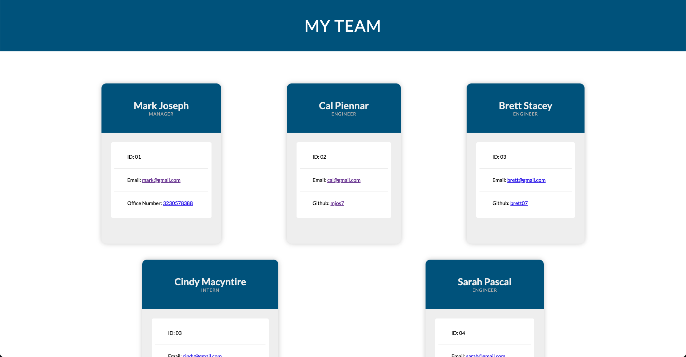

# My Team Profiles

## General

**Screenshot of Mockup**

**Recorded Demo Walk through**
https://www.loom.com/share/d2f40a81a0474d1c8850d281b8f16c49

## Description

Welcome to my Team Profile Generator

Through the command line, you can add the following information for your team starting with your manager, and then for interns and engineers.

### Manager

- Name
- ID
- Email
- Office Number

(option to add an Engineer or Intern profile)

### Engineer

- Name
- ID
- Email
- Github

### Intern

- Name
- ID
- Email
- School

(option to add another Engineer or Intern profile)

The generator will create an HTML file that is linked to the style sheet. Both will be stored in the dist folder.

## Comments

Please don't hesitate to reach out if you have any suggestions or feedback
